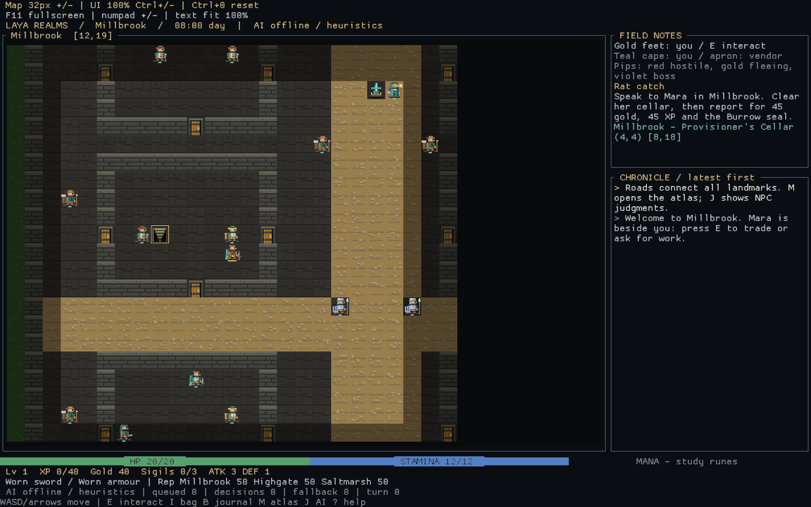

# Laya Realms

> **Status: heavily WIP.** This repository is an active development snapshot: gameplay, balance, art, and internal systems change constantly, save formats and CLI flags may break between commits, and its git history only starts at the first public snapshot. Feedback and issues are welcome — stability is not promised.

A tile RPG with terminal and windowed sprite views, where you can inspect the decisions behind NPC behaviour. Explore three cities, descend through seven dungeon floors, recover three Sigils, and face a final boss that judges your deeds. [Laya](https://huggingface.co/convaiinnovations/laya) (open weights, Apache 2.0) supplies typed judgments through a local gateway; Rust owns movement, combat, quests, and consequences. No generated dialogue.

**Playable now.** Rust, `ratatui`/`crossterm` for the terminal and `macroquad` for the window; works live with Laya or entirely offline. One save slot per seed: `Esc` → **S** saves and quits outside combat, **L** on the title resumes. Death returns you to your last city with 25% gold lost; defeated enemies and quest progress persist.

## Run

Install the current stable [Rust toolchain](https://rustup.rs/), open a terminal in this directory, then:

```sh
cargo run --release
```

Use a terminal at least **100 columns × 40 rows** for the map and side panel. Smaller windows adapt; map glyphs are single-width Unicode textures (shade blocks, clubs, spades) with a true-color palette, tuned to keep rows aligned in any font. Torch and day/night lighting fade over three distance bands; boss wind-ups pulse in place.

**A remains the default terminal view. C is a separate native window**, using procedural pixel sprites, a following camera, fog/light bands, combat warnings, and a terrain-colored atlas. Both views share controls, menus, quests, AI decisions, and save files. The window starts at 1440×900 in logical space; world zoom and interface scale are independently adjustable, and F11 toggles fullscreen without touching the save file.

```sh
cargo run --release -- --view tui --ai heuristics --seed 42
cargo run --release -- --view gui --ai heuristics --seed 42
cargo run --release --features bevy-view -- --view bevy --ai heuristics --seed 42
```

The native views can be resized and share gameplay state and saves with the
terminal. The opt-in isometric Bevy window (`--view bevy`) uses the improved
Blender NPC atlas, seamless 64px terrain plates, keyboard/pointer combat
controls, and portrait-led conversations. The older `--view gui` still uses
procedural sprites. For reproducible playable Bevy locations (city, Underkeep
and ford), see [the art pipeline run commands](docs/ART_3D_PIPELINE.md#environment-status-and-in-game-viewing).



To regenerate a starting-play screenshot (opens a window, captures, then exits):

```sh
cargo run --release -- --view gui --ai heuristics --seed 42 --gui-screenshot docs/gfx/C-live.png
```

The game defaults to live Laya when the local gateway answers (see below), otherwise deterministic heuristics. An explicit `--ai` always wins. `LAYA_GATEWAY_URL` overrides the gateway address (default `http://127.0.0.1:8128/v1/evaluate`); `LAYA_GATEWAY_TOKEN`/`laya_key.txt` supply an optional bearer for token-gated gateways and are never included in replay logs.

```sh
cargo run --release -- --ai heuristics --seed 42
cargo run --release -- --ai laya --seed 42
```

### The Laya gateway (local sidecar)

The decision models are PyTorch checkpoints, so they run in a small Python sidecar that speaks the `/v1/evaluate` dialect the game's client already uses. One-time setup:

```sh
python -m venv laya-venv
laya-venv/Scripts/pip install laya        # or bin/pip on Unix
laya-venv/Scripts/python laya_gateway.py  # :8128, checkpoints load in background
```

It downloads the English and multilingual checkpoints on first start (~1.4 GB), serves `/v1/evaluate` and `/health`, auto-routes per request, and pins ~1.5 GB VRAM on GPU (or ~200–500 ms per decision on CPU). With it running, `--ai-smoke N` exercises real NPC decisions; without it, the game falls back to seeded heuristics and never blocks.

`cargo run --release -- --help` lists the command-line options. A fixed seed reproduces terrain, personalities, and heuristic judgments for the same input/state sequence—not live model responses or different real-time input timing.

## First steps

1. Press **Enter** at the title. You start beside Mara in Millbrook.
2. **E** opens her shop; **Q** opens work and conversation. Select the local job and press **Enter**.
3. Buy a standard sword if you want an easier start. **I**, select the sword, **Enter** equips it.
4. Enter the cellar at **(8,18)** using **E**. Bump rats to attack. Inventory and combat wait for your input.
5. Report to Mara for your reward and Burrow seal. **B** tracks objectives; **M** marks destinations.

Highgate's missing caravan and Saltmarsh's smuggling job grant the other dungeon seals. You can also purchase seals. Defeat the Chief, Matriarch, and Lich to obtain the Sigils; seals alone do not unlock the Final Trial.

## Controls

| Key | Action |
| --- | --- |
| Arrows / WASD | Move; bump an enemy to attack |
| Home / PgUp / End / PgDn, or numpad 1–9 | Diagonal / eight-way movement |
| Enter / Shift+A | Attack an adjacent enemy outside menus |
| E | Talk, enter stairs/gates, open treasure, use a shrine |
| Space / period / numpad 5 | Wait |
| F / X / C | Defend / flee / spare an adjacent fleeing enemy |
| I | Inventory; Enter uses or equips; V sells beside an open vendor |
| Y | Runes: cast Spark, Mend, or Ward (costs mana; in combat a full turn) |
| R | Rest: paid inn in a city, ration and danger check outside |
| B / M | Quest journal / world atlas (Z toggles world/local; braille in A, graphical in C) |
| J | Decision inspector; `[` and `]` browse its ten recent records |
| ? / Esc | Help / pause or close a window |
| Enter / S / Q in pause | Resume / save & quit / quit without saving |

Menus use arrows or W/S and Enter. In a shop, **Q** discusses work, **H** haggles, and **I** opens your pack. **L** on the title screen loads a saved journey. The atlas's **1–3** book a caravan between already-discovered cities, from within a city only.

**Bevy pointer controls:** click an enemy in reach to strike it; click nearby
empty ground in combat to reposition once. Distant actors are inspected
instead. The combat strip offers Strike, Guard, Runes, Heal, Recover and Escape,
with unavailable actions dimmed and live stamina/initiative/wind-up advice.
Heal uses an owned healing potion or greater potion; it never spends a turn at
full health. A successful combat rune returns you to the battlefield; rejected
casts leave the rune picker open.

Combat movement requires a fresh press; holding a key cannot burn multiple
rounds. Held walking remains available outside combat and stops when combat
or a menu takes over. Positioning, flanking, initiative, stamina, bracing and
boss wind-ups still determine the fight; strike damage is not a new dice roll.

Conversations and menu lists use visual selection highlights, not text
prefixes. Click a response, use arrows/W/S and Enter, or scroll longer lists
with the wheel; hovering does not steal keyboard selection. Conversations
show the actual outcome, and a visible Leave/Close control returns to play.
World action feedback appears briefly above the HUD.

Native interaction smoke captures: [combat](docs/gfx/proto/interaction/combat.png),
[guard](docs/gfx/proto/interaction/combat-guard.png),
[dialogue outcome](docs/gfx/proto/interaction/dialogue.png), and
[trade selection](docs/gfx/proto/interaction/dialogue-trade.png).

## Campaign and combat

- Seeded **200×160 overworld**, three walled **40×40 cities**, tutorial cellar, seven **30×30 dungeon floors**, and the Final Trial arena. Seed 42 contains **261 NPCs** (including three hirable sellswords) before summons.
- Five quest threads (**B** journal): rat catch, missing caravan, branching smuggling, Sigil hunt, and Final Trial. Returning versus fencing cargo, reporting versus joining smugglers, bribes, escapes, and mercy change your record.
- **Inventory** is a 20-slot pack (**I**) with healing supplies, treasure, relic identification, one-use wayshrines, and a permanent keyring. **Shops** in each city sell consumables, gear, and dungeon seals; **H** haggles, **V** sells beside a vendor, and prices follow reputation.
- Levels **1–10**, four weapon/armour tiers (worn → masterwork), and one boss-relic slot. The Chief, Matriarch, and Lich each drop a visible relic with a distinct combat passive. Gear lists mark stat deltas and equipped relics; owned seals read "on keyring".
- Speed-based initiative, flanking, defend (**DEFENDING** shows in the HUD until your next action), stamina, escape checks, pack morale, and NPC retreats. Defending grants +50% defense for one round; walls prevent an opposite-side flank.
- The Chief rallies or sacrifices minions; the Matriarch calls a finite pack; the Lich switches between pressure, summons, curses, and retreat. The Adjudicator combines your history with your recent combat actions.
- Boss attacks mark a red **3×3 warning area**, and the combat sidebar counts the wind-up down ("resolves in 2 actions / this round"). Reinforcements are capped: fights cannot become infinite spawn grinds.
- Death screens name your killer. Shops open 06:00–20:00; thieves work at night; exterior city gates require guard permission after dark. Torches light six tiles for two in-game hours.
- **Runes**: shrine oracles teach Spark bolt, Mend, and Iron ward for tuition; each study is a visible Laya judgment and each cast spends mana from the third HUD gauge.
- **Companion**: one sellsword per city hires on for 50 gold — follows you everywhere, strikes after your action, anchors flanking, soaks hits meant for you, and rises after battle.
- **Forging**: smiths turn two matching gear pieces plus coin into the next tier; duplicate loot becomes masterwork steel.
- **Bounties**: guard captains issue seeded cull-and-deliver contracts with level-scaled rewards (up to three open), tracked in the journal beside the five campaign threads.

### Quick reference

- **Damage**: `attacker ATK − defender DEF`, minimum 1. Flanking adds 25% after armour; defending multiplies your DEF by 1.5 for the round; attacking with <2 stamina is −1 damage.
- **Gear**: each sword tier adds +3 ATK, each armour tier +2 DEF. Worn (5g), standard (35g/30g), fine (100g/90g), masterwork (230g/210g). Boss relics: Rallybreaker adds +2 damage after defending; Fangmantle adds +1 DEF while surrounded; Graveglass reduces rune costs by 1 (minimum 1). Selling ordinary gear returns about half.
- **Consumables**: potion 12g (+18 HP), ration 5g (+8 HP and stamina), torch 4g. Dungeon seals 80g / 130g / 200g, or earned from city quests. Inn 8g, caravan 10g, identifies and prophecies are free.
- **Levels**: each level costs `25 + 15 × current level` XP (the HUD shows progress). Even levels +1 ATK; every third level +1 DEF; levels 5 and 9 +1 speed; every level +6 max HP.
- **Bosses**: Chief (Burrow, ~L4), Matriarch (Crimson Hollow, ~L6), Lich (Underkeep, ~L8), Adjudicator (Final Trial, L10 with masterwork). Sigil kills fully restore you and award their unique boss relic alongside the existing gear reward.
- **Magic**: Spark 2 mana (nearest enemy within 5, ignores armour, hits like your weapon), Mend 2 mana (+12 HP, anywhere), Ward 3 mana (+2 DEF and braced, two rounds). Mana regens +1 per combat round, +1 per four seconds of travel, full at inns.
- **Saves**: `saves/journey-<seed>.json`, one per seed. Save anywhere outside combat via `Esc → S`; resume with `L` on the title of the same seed.

Exploration input is polled every 4 ms, with buffered movement and state-driven redraws capped around 60 Hz. The world advances at 4 Hz. Combat advances on valid actions only; menus pause simulation. Network calls never run on the input path.

## Laya and failure handling

Requests go to the local Laya gateway's `/v1/evaluate` (open-weights `convaiinnovations/laya`, self-hosted). The adapter translates the design's `noul` primitive into the wire's `boolean` question / `probability` answer. Choices retain their probability distributions; score indices are normalized before rules use them.

At most eight requests are outstanding. Each has a five-second attempt timeout and one retry. Invalid, partial, timed-out, or rejected responses use a complete deterministic fallback, never invented answers labelled as Laya. Five consecutive failures switch the whole session to heuristics with a persistent HUD warning. Connection and load-time errors follow the same policy.

`J` shows provider, probabilities, latency, and the applied rule. `replay_logs/*.jsonl` records requests, results, and applied/discarded decisions; those files are ignored by Git. Reported cost is an input-token estimate, not an invoice.

## Verification and measurements

```sh
cargo test
cargo test -p laya-realms -p realms-view -p laya-realms-bin --features bevy-view
cargo run --release -- --smoke --seed 42
cargo run --release -- --benchmark --seed 42
cargo run --release -- --ai laya --ai-smoke 5 --seed 42
```

`--smoke` exercises input, decisions, the road and modal screens at five terminal sizes. It checks the generated world rather than pinning a map/NPC count. `--benchmark` runs 10,000 simulation ticks, excluding terminal drawing and network time. `--ai-smoke N` evaluates up to 50 requests, prioritizing the two showcase bosses, and stops live requests after five failures.

Implementation playtests used an action-driven, non-cheating full-campaign harness, including actual walking, buying/equipping supplies, fights, quest turn-ins, and Sigil-gated travel. Human completion time has not been measured; there is no artificial timer or required grinding loop.

Measured local-gateway run (RTX 4090): **12/12 valid Laya responses, p95 148 ms** — within the 150 ms tier-1 budget — at ~60–90 ms per batched request, 14,907 reported input tokens, **$0** (self-hosted). An earlier hosted-gateway run measured 30 valid responses, five fallbacks, and p95 641 ms. A populated-city simulation run took approximately **81 ms for 10,000 ticks** on the development machine. These are observations, not latency or cost guarantees.

## Source map

- `src/main.rs`: CLI selection, terminal lifecycle, frame/simulation clocks and headless checks (the binary; everything below is the sim library)
- `crates/core/src/gui.rs`: native window loop, hardware-key translation, shared HUD/menu composition
- `crates/core/src/sprites.rs`: procedural terrain, archetype/equipment sprites, view-local actor animation, camera, lighting and graphical atlas
- `crates/core/src/input.rs`: shared controls and modal/action routing
- `crates/core/src/persist.rs`: shared per-seed save/load
- `crates/core/src/model.rs`: authoritative game state and typed decision contracts
- `crates/core/src/world.rs`: deterministic terrain, maps, portals, population, tuning
- `crates/core/src/engine.rs`: simulation, tactical combat, bosses, state building, decision application
- `crates/core/src/social.rs`: interactions, economy, quest state machines, gates, shrines
- `crates/core/src/laya_client.rs`: gateway protocol, providers, validation, queue, shared decision pump/failure policy and replay logging
- `crates/core/src/ui.rs`: shared HUD, inspector and modal screens; terminal terrain and braille atlas
- `crates/view/`: experimental Bevy window (`--view bevy`); read-only snapshot of the same `Game`, Action verbs in, atlas textures + sim-lit light map out
- `tools/atlas/`: procedural atlas baker for terrain/actor/prop sheets ([ART_PIPELINE.md](docs/ART_PIPELINE.md))
- `spikes/e0/`: archived E0 engine-spike evidence (throwaway)

Design references: [Game design](docs/GAME_DESIGN.md), [AI architecture](docs/AI_ARCHITECTURE.md), [Roadmap and verification notes](docs/ROADMAP.md), [Visual roadmap for the windowed view](docs/VISUAL_ROADMAP.md). Original render-style comparisons and a live C capture are in [docs/gfx](docs/gfx/index.html); the [actor contact sheet](docs/gfx/C-actors.png) shows all archetypes, equipment tiers and boss phases.

## License

MIT
